# Architecture Diagrams - Agent System

Cette documentation présente les diagrammes d'architecture du système d'agents OllamAssist.

---

## 1. Vue d'Ensemble du Système

```mermaid
graph TB
    subgraph "User Interface"
        UI[MessagesPanel]
        Toggle[AgentModeToggle]
        PlanPanel[PlanDisplayPanel]
        TracePanel[ExecutionTracePanel]
    end

    subgraph "OllamaService"
        Assistant[Assistant<br/>Chat Mode]
        Orchestrator[OrchestratorAgent<br/>Agent Mode]
        Memory[ChatMemory<br/>Shared]
    end

    subgraph "Specialized Agents"
        RAG[RagSearchAgent<br/>@Tool: searchCode<br/>@Tool: searchDocumentation<br/>@Tool: searchSimilarCode]
        Git[GitAgent<br/>@Tool: gitStatus<br/>@Tool: gitDiff<br/>@Tool: gitCommit<br/>@Tool: gitLog]
        Refactor[RefactoringAgent<br/>@Tool: analyzeCode<br/>@Tool: suggestRefactoring<br/>@Tool: applyRefactoring]
        Analysis[CodeAnalysisAgent<br/>@Tool: analyzeComplexity<br/>@Tool: analyzeDependencies<br/>@Tool: detectCodeSmells]
    end

    subgraph "Infrastructure"
        Ollama[Ollama LLM<br/>llama3.2]
        VectorStore[LuceneEmbeddingStore]
        GitRepo[Git Repository]
        PSI[IntelliJ PSI]
    end

    UI -->|chat mode| Assistant
    UI -->|agent mode| Orchestrator
    Toggle -->|switch| OllamaService

    Orchestrator -->|delegates| RAG
    Orchestrator -->|delegates| Git
    Orchestrator -->|delegates| Refactor
    Orchestrator -->|delegates| Analysis

    Assistant -->|LLM calls| Ollama
    Orchestrator -->|LLM calls| Ollama

    RAG -->|semantic search| VectorStore
    Git -->|operations| GitRepo
    Refactor -->|code analysis| PSI
    Analysis -->|metrics| PSI

    Orchestrator -->|plan display| PlanPanel
    Orchestrator -->|traces| TracePanel
```

---

## 2. Orchestrator Flow (Flux d'Exécution Agent)

```mermaid
sequenceDiagram
    participant User
    participant UI as MessagesPanel
    participant Orch as OrchestratorAgent
    participant PlanGen as PlanGenerator
    participant PlanVal as PlanValidator
    participant Deleg as AgentDelegator
    participant Agent as SpecializedAgent
    participant Obs as ObservabilityCollector
    participant LLM as Ollama LLM

    User->>UI: Enter request<br/>"Find all TODOs in code"
    UI->>Orch: executeAgentRequest(request)

    activate Orch
    Orch->>Obs: init(executionId)
    Orch->>PlanGen: generatePlan(request)

    activate PlanGen
    PlanGen->>LLM: Generate plan<br/>(Structured Output)
    Note over PlanGen,LLM: Temperature: 0.3<br/>JSON Schema: Plan
    LLM-->>PlanGen: Plan { steps: [...] }
    PlanGen-->>Orch: Plan (1-10 steps)
    deactivate PlanGen

    Orch->>PlanVal: validateWithUser(plan)
    activate PlanVal
    PlanVal->>UI: Display plan<br/>(Accept/Reject/Modify)
    UI->>User: Show plan
    User->>UI: Accept ✓
    UI-->>PlanVal: ValidationResult.ACCEPTED
    PlanVal-->>Orch: ValidationResult
    deactivate PlanVal

    loop For each step in Plan
        Orch->>Obs: startStep(stepNumber, agentType, action)
        Obs->>UI: onStepStarted(stepTrace)
        UI->>User: Display "Step 1 running..."

        Orch->>Deleg: executeStep(planStep, context)
        activate Deleg
        Deleg->>Agent: selectTool(action)
        Agent-->>Deleg: @Tool method

        alt Tool requires approval
            Deleg->>UI: Request approval
            UI->>User: Confirm action?
            User->>UI: Approve ✓
            UI-->>Deleg: Approved
        end

        Deleg->>Agent: execute(params, stepTrace)
        activate Agent

        alt RAG Agent
            Agent->>LLM: embed(query)
            LLM-->>Agent: Embedding
            Note over Agent: Search in VectorStore
            Agent-->>Agent: Convert to SourceReferences
        else Git Agent
            Note over Agent: Use Git4Idea APIs
        else Refactoring Agent
            Note over Agent: PSI analysis + LLM suggestions
        else Analysis Agent
            Note over Agent: Calculate metrics (PSI)
        end

        Agent-->>Deleg: ToolResult(output, sources)
        deactivate Agent

        Deleg-->>Orch: ToolResult
        deactivate Deleg

        Orch->>Obs: recordStepSuccess(stepTrace, result)
        Obs->>UI: onStepCompleted(stepTrace)
        UI->>User: Display "Step 1 ✓ completed"
    end

    Orch->>Obs: complete(COMPLETED)
    Obs->>UI: onExecutionCompleted(trace)
    Orch-->>UI: AgentResponse(result, trace, sources)
    deactivate Orch

    UI->>User: Display final result<br/>+ sources + traces
```



---

## 3. Plan Generation (Structured Output)

```mermaid
graph TB
    subgraph "Input"
        UserReq[User Request<br/>'Find all TODO comments']
    end

    subgraph "PlanGenerator"
        SystemPrompt[System Prompt<br/>Available agents:<br/>- RAG_SEARCH<br/>- GIT<br/>- REFACTORING<br/>- CODE_ANALYSIS<br/><br/>Max steps: 5<br/>Require justifications]

        LLMCall[Ollama LLM Call<br/>Temperature: 0.3<br/>Response Format:<br/>JSON Schema]

        Schema[Plan Schema<br/>goal: string<br/>steps: PlanStep[]<br/>estimatedDuration: int]
    end

    subgraph "Output"
        Plan[Plan Object<br/>goal: 'Find TODO comments'<br/>steps:<br/>1. RAG_SEARCH: searchCode<br/>2. CODE_ANALYSIS: analyzeComplexity<br/>estimatedDuration: 30s]
    end

    UserReq --> SystemPrompt
    SystemPrompt --> LLMCall
    Schema --> LLMCall
    LLMCall --> Plan

    style LLMCall fill:#e1f5ff
    style Schema fill:#fff4e1
    style Plan fill:#e8f5e9
```

**Plan JSON Example:**
```json
{
  "goal": "Find all TODO comments in the codebase",
  "steps": [
    {
      "stepNumber": 1,
      "agentType": "RAG_SEARCH",
      "action": "Search for TODO comments using semantic search",
      "justification": "RAG can find TODO patterns across all indexed files",
      "expectedOutput": "List of files containing TODO comments with line numbers"
    },
    {
      "stepNumber": 2,
      "agentType": "CODE_ANALYSIS",
      "action": "Analyze complexity of methods with TODOs",
      "justification": "Understanding complexity helps prioritize TODO resolution",
      "expectedOutput": "Complexity metrics for methods containing TODOs"
    }
  ],
  "estimatedDuration": 30
}
```

---

## 4. Tool Execution Flow (@Tool Method)


**ToolResult Structure:**
```java
ToolResult {
    output: "Found 15 TODO comments across 8 files:\n- src/Main.java:45...",
    sources: [
        SourceReference {
            uri: "src/main/java/Main.java",
            lineStart: 45,
            lineEnd: 47,
            snippet: "// TODO: Refactor this method",
            relevanceScore: 0.92,
            description: "TODO comment in Main.java"
        },
        // ... 14 more
    ],
    success: true
}
```

---

## 5. Observability System

```mermaid
graph TB
    subgraph "Collection"
        Collector[ObservabilityCollector]
        ExecTrace[ExecutionTrace<br/>- executionId<br/>- startTime, endTime<br/>- totalDuration<br/>- finalState<br/>- stepTraces[]<br/>- allSources[]<br/>- metrics]
        StepTrace[StepTrace<br/>- stepId<br/>- stepNumber<br/>- agentType<br/>- toolName<br/>- action<br/>- startTime, endTime<br/>- state<br/>- inputParameters<br/>- output<br/>- reasoning<br/>- sources[]<br/>- logs[]]
    end

    subgraph "Listeners"
        UIListener[ExecutionTraceUIListener]
        ChatListener[ChatModelListener<br/>- onRequest<br/>- onResponse<br/>- onError]
    end

    subgraph "UI Display"
        TracePanel[ExecutionTracePanel<br/>- Steps list<br/>- Sources list<br/>- Metrics display<br/>- Reasoning viewer]
    end

    subgraph "Metrics"
        Metrics[ExecutionMetrics<br/>- totalLLMCalls<br/>- totalTokensInput<br/>- totalTokensOutput<br/>- estimatedCost<br/>- llmTotalTime<br/>- toolExecutionTime<br/>- failures, retries]
    end

    Collector -->|manages| ExecTrace
    ExecTrace -->|contains| StepTrace
    ExecTrace -->|contains| Metrics

    Collector -->|notifies| UIListener
    Collector -->|notifies| ChatListener

    UIListener -->|updates| TracePanel
    ChatListener -->|records| Metrics

    style ExecTrace fill:#e8f5e9
    style StepTrace fill:#fff4e1
    style Metrics fill:#e1f5ff
```

---

## 6. ChatModelListener Integration


**Attributes Map Usage:**
```java
// In onRequest
attributes.put("request-start", Instant.now());
attributes.put("step-id", currentStepId);

// In onResponse
Instant start = (Instant) attributes.get("request-start");
Duration duration = Duration.between(start, Instant.now());
```

---

## 7. Agent Registry Pattern

```mermaid
graph TB
    subgraph "AgentRegistry"
        Registry[AgentRegistry]
        Map[ConcurrentHashMap<br/>AgentType → Agent]
    end

    subgraph "Agent Implementations"
        RAG[RagSearchAgent<br/>implements Agent]
        Git[GitAgent<br/>implements Agent]
        Refactor[RefactoringAgent<br/>implements Agent]
        Analysis[CodeAnalysisAgent<br/>implements Agent]
    end

    subgraph "Agent Interface"
        IAgent[Agent Interface<br/>- getType<br/>- getDescription<br/>- getTools<br/>- selectTool<br/>- isEnabled]
    end

    subgraph "Tools"
        RAGTools[@Tool searchCode<br/>@Tool searchDocumentation<br/>@Tool searchSimilarCode]
        GitTools[@Tool gitStatus<br/>@Tool gitDiff<br/>@Tool gitCommit<br/>@Tool gitLog]
        RefactorTools[@Tool analyzeCode<br/>@Tool suggestRefactoring<br/>@Tool applyRefactoring]
        AnalysisTools[@Tool analyzeComplexity<br/>@Tool analyzeDependencies<br/>@Tool detectCodeSmells]
    end

    Registry -->|manages| Map
    Map -->|RAG_SEARCH| RAG
    Map -->|GIT| Git
    Map -->|REFACTORING| Refactor
    Map -->|CODE_ANALYSIS| Analysis

    RAG -.implements.- IAgent
    Git -.implements.- IAgent
    Refactor -.implements.- IAgent
    Analysis -.implements.- IAgent

    RAG -->|exposes| RAGTools
    Git -->|exposes| GitTools
    Refactor -->|exposes| RefactorTools
    Analysis -->|exposes| AnalysisTools

    style Registry fill:#e1f5ff
    style IAgent fill:#fff4e1
```

**Registry Usage:**
```java
// Initialization (OllamaService startup)
AgentRegistry registry = new AgentRegistry(project);
registry.register(new RagSearchAgent(project));
registry.register(new GitAgent(project));
registry.register(new RefactoringAgent(project));
registry.register(new CodeAnalysisAgent(project));

// During execution (AgentDelegator)
Agent agent = registry.getAgent(AgentType.RAG_SEARCH);
AgentTool tool = agent.selectTool("search for code");
ToolResult result = tool.execute(parameters, stepTrace);
```

---

## 8. Human-in-the-Loop Points


**Checkpoints Details:**

1. **Plan Validation** (before execution starts)
   - User sees: Goal + Steps + Estimated duration
   - Actions: Accept / Reject / Modify
   - Location: `PlanValidator` → `PlanDisplayPanel`

2. **Action Validation** (during execution, for destructive tools)
   - Triggered for: `gitCommit`, `applyRefactoring`
   - User sees: Action description + Files affected
   - Actions: Approve / Reject
   - Location: `ActionValidator` → Dialog prompt

3. **User Controls** (always available)
   - Cancel: Stop execution immediately
   - Pause: Suspend and preserve state
   - Resume: Continue from paused state
   - Location: `ExecutionTracePanel` controls

---

## 9. Data Flow - Complete Example

**Scenario:** User asks "Find all TODO comments and analyze their complexity"


---

## 10. Class Diagram - Core Domain Model


---

## Légende des Diagrammes

### Couleurs
- 🔵 **Bleu clair** (`#e1f5ff`) : Infrastructure / Registry / Configuration
- 🟡 **Jaune** (`#fff4e1`) : Interfaces / Schemas / Intermediate objects
- 🟢 **Vert** (`#e8f5e9`) : Résultats / Outputs / Success states
- 🟣 **Violet** (`#f3e5f5`) : Traces / Observability
- 🔴 **Rouge** (`#ffebee`) : Validation points / Human-in-the-loop

### Symboles
- `→` : Data flow
- `-.->` : Implements / Extends
- `<<interface>>` : Interface Java
- `<<enumeration>>` : Enum Java
- `$` : Static method
- `*` : Multiple cardinality

---

## Résumé des Flux Clés

### 1. User Request → Agent Response
User → MessagesPanel → OrchestratorAgent → PlanGenerator → [LLM] → Plan → PlanValidator → [User Approval] → AgentDelegator → SpecializedAgent → @Tool execution → ToolResult → StepTrace → ExecutionTrace → AgentResponse → UI

### 2. Tool Execution
AgentDelegator → AgentRegistry → Agent.selectTool() → @Tool method → [External systems: VectorStore/Git/PSI/LLM] → ToolResult (output + sources)

### 3. Observability
Tool execution → ChatModelListener.onRequest/onResponse/onError → Metrics collection → ObservabilityCollector → StepTrace → ExecutionTrace → ExecutionTraceUIListener → UI updates

### 4. Human-in-the-Loop
Checkpoint 1: Plan validation (Accept/Reject/Modify)
Checkpoint 2: Destructive action approval (Approve/Reject)
Checkpoint 3: Execution controls (Continue/Cancel/Pause/Resume)

---

**Prochaine étape:** Phase 2 - Implémentation du modèle de domaine avec TDD
